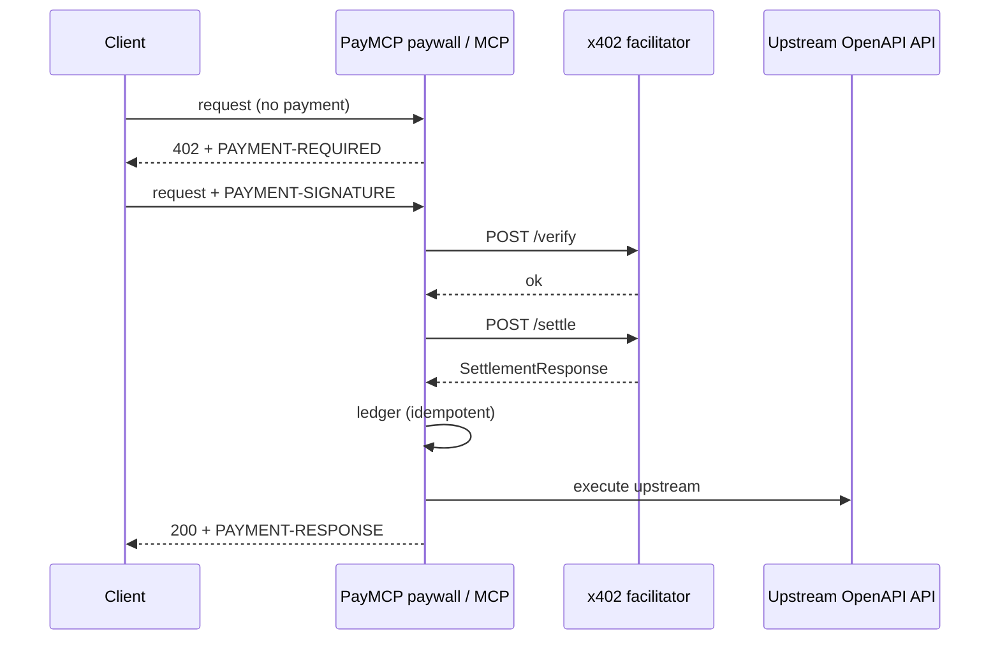

# PayMCP

[](https://www.npmjs.com/package/openapi-to-paymcp)
[](LICENSE)
[](https://www.npmjs.com/package/openapi-to-paymcp)

Turn an existing **OpenAPI 3.x** spec into a **paid MCP server** with HTTP 402 + [x402](https://x402.org) settlement.

**npm:** [`openapi-to-paymcp`](https://www.npmjs.com/package/openapi-to-paymcp) · **CLI:** `paymcp` · **repo:** [ranjan2829/PayMCP](https://github.com/ranjan2829/PayMCP)

## Why / What it is

PayMCP is an **adapter**, not a new payment protocol. It compiles your OpenAPI operations into:

- a **paid MCP server** (tools that challenge, settle, then call upstream)
- a **Fastify paywall** (HTTP 402 + x402 headers on paid routes)
- a **settlement ledger** (SQLite by default, optional Postgres)

Settlement always goes through a **real HTTP facilitator** (`POST /verify` + `POST /settle`). There is no FakeSettler and no simulated settlement product mode.

## Quickstart

```bash
npm i -g openapi-to-paymcp
paymcp ./openapi.yaml --out ./paid-server

# or one-shot:
npx openapi-to-paymcp ./openapi.yaml --out ./paid-server
```

Set the required env vars (see [Configuration](#configuration)), then run the generated server. Copy [`.env.example`](.env.example) as a starting point — never commit `.env`.

## How it works



ASCII equivalent:

```
Client ──402──► PayMCP (paywall / MCP)
                   │  PAYMENT-REQUIRED → client signs
                   │  PAYMENT-SIGNATURE → FacilitatorSettler
                   ▼
             facilitator  (/verify → /settle)
                   ▼
             ledger (SQLite | Postgres)
                   ▼
             upstream OpenAPI + PAYMENT-RESPONSE
```

| Path | Role |
|------|------|
| `packages/paymcp` (`openapi-to-paymcp`) | Publishable CLI + library |
| `examples/demo-api` | Sample Fastify API with `x-paymcp` prices |
| `scripts/demo.mjs` | Protocol **fixture** demo (not live money) |
| `scripts/live-settle.mjs` | **Live** settle (gated by `PAYMCP_LIVE=1`) |

## Configuration

Settlement **always** targets a real facilitator base URL. Boot is fail-fast (zod): missing/invalid facilitator, payTo, network, or asset aborts with a clear multi-line error.

### Required

| Variable | Example |
|----------|---------|
| `PAYMCP_FACILITATOR_URL` | `https://x402.org/facilitator` |
| `PAYMCP_PAY_TO` | `0xYourRecipientAddress` |
| `PAYMCP_NETWORK` | `eip155:84532` (Base Sepolia) or `eip155:8453` (Base) |
| `PAYMCP_ASSET` | USDC contract on that network |

### Optional

| Variable | Purpose |
|----------|---------|
| `PAYMCP_FACILITATOR_AUTH_TOKEN` | Bearer/JWT for CDP facilitator |
| `CDP_API_KEY_ID` / `CDP_API_KEY_SECRET` | Operator docs (mint token separately; not required at runtime if you set the auth token) |
| `PAYMCP_ASSET_NAME` | Default `USDC` in accepts extra |
| `PAYMCP_MAX_TIMEOUT_SECONDS` | Accept window |
| `PAYMCP_SCHEME` | `exact` \| `upto` |
| `PAYMCP_LEDGER_PATH` | SQLite path (default `./paymcp-ledger.db`) |
| `PAYMCP_DATABASE_URL` | `postgres://…` → Postgres ledger |
| `PAYMCP_FACILITATOR_TIMEOUT_MS` | Default `15000` |
| `PAYMCP_FACILITATOR_MAX_RETRIES` | 5xx/network only (default `2`) |
| `PAYMCP_RATE_LIMIT_MAX` | Paid-route rate limit (`0` = off) |
| `PAYMCP_RATE_LIMIT_WINDOW_MS` | Default `60000` |

## Demo (fixture) vs live money

### Protocol fixture demo — **not live money**

`pnpm demo` drives unpaid → 402 → PAYMENT-SIGNATURE → 200 + PAYMENT-RESPONSE using the real `FacilitatorSettler` HTTP client against a **recorded facilitator protocol fixture** (same JSON shapes as production `/verify` and `/settle`). No on-chain funds move.

```bash
pnpm build
pnpm demo
```

### Live money — Base Sepolia, then Base mainnet

Use a real facilitator and a real wallet. Prefer Sepolia first.

**1) Base Sepolia (recommended first)**

| Setting | Value |
|---------|-------|
| Facilitator | `https://x402.org/facilitator` |
| Network | `eip155:84532` |
| USDC | `0x036CbD53842c5426634e7929541eC2318f3dCF7e` |
| EIP-712 name / version | `USDC` / `2` |

```bash
export PAYMCP_FACILITATOR_URL=https://x402.org/facilitator
export PAYMCP_PAY_TO=0xYourRecipient
export PAYMCP_NETWORK=eip155:84532
export PAYMCP_ASSET=0x036CbD53842c5426634e7929541eC2318f3dCF7e
pnpm --filter @paymcp/demo-api build
pnpm --filter @paymcp/demo-api start
# GET /healthz  GET /readyz
```

**2) Base mainnet (CDP)**

| Setting | Value |
|---------|-------|
| Facilitator | `https://api.cdp.coinbase.com/platform/v2/x402` |
| Network | `eip155:8453` |
| USDC | `0x833589fCD6eDb6E08f4c7C32D4f71b54bdA02913` |
| EIP-712 name / version | `USD Coin` / `2` |
| Auth | `PAYMCP_FACILITATOR_AUTH_TOKEN=Bearer <jwt>` |

**Wallet / payer (PAYMENT-SIGNATURE)** — do not invent signing crypto. Use the official x402 client:

- Docs: [Quickstart for buyers](https://docs.x402.org/getting-started/quickstart-for-buyers)
- Packages: `@x402/fetch`, `@x402/evm` (`ExactEvmScheme`), `viem` accounts
- Spec: [exact EVM / EIP-3009](https://github.com/x402-foundation/x402/blob/main/specs/schemes/exact/scheme_exact_evm.md)

```ts
import { wrapFetchWithPayment, x402Client } from "@x402/fetch";
import { ExactEvmScheme } from "@x402/evm/exact/client";
import { privateKeyToAccount } from "viem/accounts";

const signer = privateKeyToAccount(process.env.EVM_PRIVATE_KEY!);
const client = new x402Client();
client.register("eip155:*", new ExactEvmScheme(signer));
const fetchWithPayment = wrapFetchWithPayment(fetch, client);

const res = await fetchWithPayment("http://127.0.0.1:8787/echo", {
  method: "POST",
  headers: { "content-type": "application/json" },
  body: JSON.stringify({ message: "hello" }),
});
```

**Live settle script** (refuses unless `PAYMCP_LIVE=1`; never prints the full signature):

```bash
# terminal 1: demo-api with real env
pnpm --filter @paymcp/demo-api start

# terminal 2:
PAYMCP_LIVE=1 \
PAYMENT_SIGNATURE_B64=... \
DEMO_API_URL=http://127.0.0.1:8787 \
node scripts/live-settle.mjs
```

### x402 V2 headers

| Header | Direction | Body |
|--------|-----------|------|
| `PAYMENT-REQUIRED` | server → client | base64 `PaymentRequired` |
| `PAYMENT-SIGNATURE` | client → server | base64 `PaymentPayload` |
| `PAYMENT-RESPONSE` | server → client | base64 `SettlementResponse` |

## Security practices

- **Fail-closed settle** — network errors, verify rejects, and settle failures never succeed the request
- **Redacted logs** — `PAYMENT-SIGNATURE` and `Authorization` are never logged in full
- **No secrets in the package** — `.env` is gitignored; publish includes only `dist`, `bin`, docs
- **Idempotency** — ledger keys prevent double-credit on retries
- **Optional rate limit** — `PAYMCP_RATE_LIMIT_MAX` on paid routes
- **Request IDs** — `x-request-id` on every request (demo-api)

See [SECURITY.md](SECURITY.md) for how to report vulnerabilities.

## Library API

```bash
npm i openapi-to-paymcp
```

```ts
import {
  paymcpPaywall,
  loadConfigFromEnv,
  buildPriceTable,
  loadPricesFile,
  compileOperations,
  loadOpenApi,
  FacilitatorSettler,
  createPaidMcpServer,
} from "openapi-to-paymcp";
```

CLI from the monorepo:

```bash
pnpm exec paymcp ./examples/demo-api/openapi.yaml --out ./paid-server
pnpm exec paymcp ./examples/demo-api/openapi.yaml \
  --prices ./examples/demo-api/prices.yaml \
  --serve --upstream http://127.0.0.1:8787
```

Agent skill notes: [`packages/paymcp/SKILL.md`](packages/paymcp/SKILL.md).

## Monorepo develop / Docker / CI

```bash
pnpm install
pnpm build
pnpm typecheck
pnpm test
```

```bash
cp .env.example .env   # fill required vars — never commit .env
docker compose up --build
curl -s http://127.0.0.1:8787/healthz
```

CI (GitHub Actions): install → typecheck → build → test on Node 20.

### Publish (`openapi-to-paymcp`)

Root monorepo stays `private`. Only `packages/paymcp` publishes.

```bash
pnpm --filter openapi-to-paymcp publish --access public
```

`prepublishOnly` runs the TypeScript build.

## Contributing

See [CONTRIBUTING.md](CONTRIBUTING.md). Bug reports and focused PRs welcome.

## License

[MIT](LICENSE)

---

- npm: https://www.npmjs.com/package/openapi-to-paymcp
- GitHub: https://github.com/ranjan2829/PayMCP
