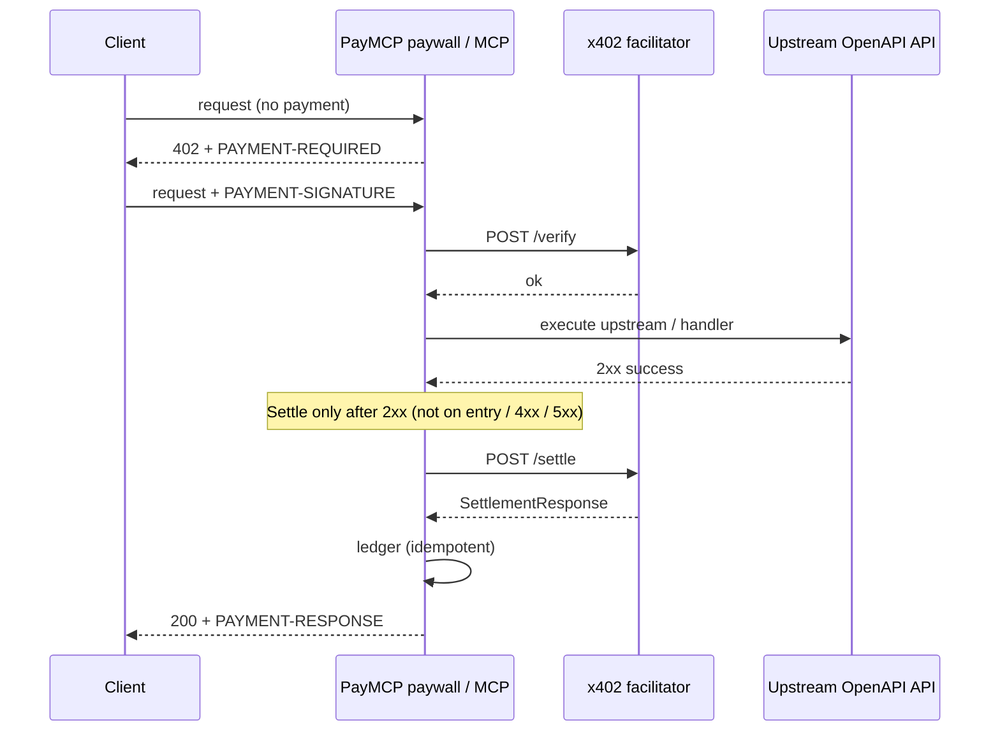

# PayMCP

[](https://www.npmjs.com/package/openapi-to-paymcp)
[](LICENSE)
[](https://www.npmjs.com/package/openapi-to-paymcp)

Turn an existing **OpenAPI 3.x** spec into a **paid MCP server** with HTTP 402 + [x402](https://x402.org) settlement.

**npm:** [`openapi-to-paymcp`](https://www.npmjs.com/package/openapi-to-paymcp) · **CLI:** `paymcp` · **repo:** [ranjan2829/PayMCP](https://github.com/ranjan2829/PayMCP)

## Why / What it is

PayMCP is an **adapter**, not a new payment protocol. It compiles your OpenAPI operations into:

- a **paid MCP server** (tools that challenge, verify, call upstream, then settle on 2xx)
- a **Fastify paywall** (HTTP 402 + x402 headers on paid routes)
- a **settlement ledger** (SQLite by default, optional Postgres)

Settlement always goes through a **real HTTP facilitator** (`POST /verify` + `POST /settle`). There is no FakeSettler and no simulated settlement product mode.

## Quickstart

```bash
npm i -g openapi-to-paymcp
paymcp ./openapi.yaml --out ./paid-server

# or one-shot:
npx openapi-to-paymcp ./openapi.yaml --out ./paid-server
```

Set the required env vars (see [Configuration](#configuration)), then run the generated server. Copy [`.env.example`](.env.example) as a starting point — never commit `.env`.

## How it works



ASCII equivalent:

```
Client ──402──► PayMCP (paywall / MCP)
                   │  PAYMENT-REQUIRED → client signs
                   │  PAYMENT-SIGNATURE → verify (early)
                   ▼
             upstream / handler
                   │  2xx only → FacilitatorSettler.settle
                   │  4xx/5xx  → do NOT settle (ledger failed)
                   ▼
             ledger (SQLite | Postgres) + PAYMENT-RESPONSE
```

**Settlement timing:** `FacilitatorSettler.settle` runs only after a successful upstream/handler response (**2xx**), not on tool-call or paywall entry. Verify may run early; failed upstream responses never settle. Already-settled `Idempotency-Key`s skip verify/settle; in-flight keys fail closed (`409`).

| Path | Role |
|------|------|
| `packages/paymcp` (`openapi-to-paymcp`) | Publishable CLI + library |
| `packages/harness-ci` | Agent-trace quality gate (CI harness) |
| `examples/demo-api` | Sample Fastify API with `x-paymcp` prices |
| `examples/buyer` | Buyer **example** using `@x402/fetch` (402 → pay → retry) |
| `scripts/demo.mjs` | Protocol **fixture** demo (not live money) |
| `scripts/live-settle.mjs` | **Live** settle (gated by `PAYMCP_LIVE=1`) |

## Configuration

Settlement **always** targets a real facilitator base URL. Boot is fail-fast (zod): missing/invalid facilitator, payTo, network, or asset aborts with a clear multi-line error.

### Required

| Variable | Example |
|----------|---------|
| `PAYMCP_FACILITATOR_URL` | `https://x402.org/facilitator` |
| `PAYMCP_PAY_TO` | `0xYourRecipientAddress` |
| `PAYMCP_NETWORK` | `eip155:84532` (Base Sepolia) or `eip155:8453` (Base) |
| `PAYMCP_ASSET` | USDC contract on that network |

### Optional

| Variable | Purpose |
|----------|---------|
| `PAYMCP_FACILITATOR_AUTH_TOKEN` | Bearer/JWT for CDP facilitator |
| `CDP_API_KEY_ID` / `CDP_API_KEY_SECRET` | Operator docs (mint token separately; not required at runtime if you set the auth token) |
| `PAYMCP_ASSET_NAME` | Default `USDC` in accepts extra |
| `PAYMCP_MAX_TIMEOUT_SECONDS` | Accept window |
| `PAYMCP_SCHEME` | `exact` \| `upto` |
| `PAYMCP_LEDGER_PATH` | SQLite path (default `./paymcp-ledger.db`) |
| `PAYMCP_DATABASE_URL` | `postgres://…` → Postgres ledger |
| `PAYMCP_FACILITATOR_TIMEOUT_MS` | Default `15000` |
| `PAYMCP_FACILITATOR_MAX_RETRIES` | 5xx/network only (default `2`) |
| `PAYMCP_RATE_LIMIT_MAX` | Paid-route rate limit (`0` = off) |
| `PAYMCP_RATE_LIMIT_WINDOW_MS` | Default `60000` |
| `PAYMCP_DISPUTE_HMAC_SECRET` | HMAC secret for `dispute-pack` signing (≥16 chars) |
| `PAYMCP_WEBHOOK_URL` | Billing webhook URL (optional; omit to disable) |
| `PAYMCP_WEBHOOK_SECRET` | HMAC secret for `X-PayMCP-Signature` (≥16 chars; required if URL set) |
| `PAYMCP_WEBHOOK_TIMEOUT_MS` | Webhook HTTP timeout (default `5000`) |
| `PAYMCP_WEBHOOK_MAX_RETRIES` | 5xx/network retries for webhook (default `2`) |

## Demo (fixture) vs live money

### Protocol fixture demo — **not live money**

`pnpm demo` drives unpaid → 402 → PAYMENT-SIGNATURE → 200 + PAYMENT-RESPONSE using the real `FacilitatorSettler` HTTP client against a **recorded facilitator protocol fixture** (same JSON shapes as production `/verify` and `/settle`). No on-chain funds move.

```bash
pnpm build
pnpm demo
```

### Live money — Base Sepolia, then Base mainnet

Use a real facilitator and a real wallet. Prefer Sepolia first.

**1) Base Sepolia (recommended first)**

| Setting | Value |
|---------|-------|
| Facilitator | `https://x402.org/facilitator` |
| Network | `eip155:84532` |
| USDC | `0x036CbD53842c5426634e7929541eC2318f3dCF7e` |
| EIP-712 name / version | `USDC` / `2` |

```bash
export PAYMCP_FACILITATOR_URL=https://x402.org/facilitator
export PAYMCP_PAY_TO=0xYourRecipient
export PAYMCP_NETWORK=eip155:84532
export PAYMCP_ASSET=0x036CbD53842c5426634e7929541eC2318f3dCF7e
pnpm --filter @paymcp/demo-api build
pnpm --filter @paymcp/demo-api start
# GET /healthz  GET /readyz
```

**2) Base mainnet (CDP)**

| Setting | Value |
|---------|-------|
| Facilitator | `https://api.cdp.coinbase.com/platform/v2/x402` |
| Network | `eip155:8453` |
| USDC | `0x833589fCD6eDb6E08f4c7C32D4f71b54bdA02913` |
| EIP-712 name / version | `USD Coin` / `2` |
| Auth | `PAYMCP_FACILITATOR_AUTH_TOKEN=Bearer <jwt>` |

**Wallet / payer (PAYMENT-SIGNATURE)** — do not invent signing crypto. Use the official x402 client:

- Docs: [Quickstart for buyers](https://docs.x402.org/getting-started/quickstart-for-buyers)
- Packages: `@x402/fetch` `^2.25.0`, `@x402/evm` `^2.25.0` (`ExactEvmScheme`), `viem` accounts
- Spec: [exact EVM / EIP-3009](https://github.com/x402-foundation/x402/blob/main/specs/schemes/exact/scheme_exact_evm.md)
- Runnable example: [`examples/buyer`](examples/buyer) (`pnpm buyer:example`)

```ts
import { wrapFetchWithPayment, x402Client } from "@x402/fetch";
import { ExactEvmScheme } from "@x402/evm/exact/client";
import { privateKeyToAccount } from "viem/accounts";

const signer = privateKeyToAccount(process.env.EVM_PRIVATE_KEY!);
const client = new x402Client();
client.register("eip155:*", new ExactEvmScheme(signer));
const fetchWithPayment = wrapFetchWithPayment(fetch, client);

const res = await fetchWithPayment("http://127.0.0.1:8787/echo", {
  method: "POST",
  headers: { "content-type": "application/json" },
  body: JSON.stringify({ message: "hello" }),
});
```

### Buyer example (`@x402/fetch`)

This is an **example**, not a new protocol. `wrapFetchWithPayment` handles unpaid → 402 + `PAYMENT-REQUIRED` → sign → retry with `PAYMENT-SIGNATURE`. The PayMCP server still verifies and settles through its **real** facilitator after a 2xx handler. The buyer client does **not** call `/verify` or `/settle`.

Set `PAYMCP_ASSET_NAME=USDC` on the server so the 402 `extra.name` / `extra.version` fields match EIP-3009 domain data.

```bash
# terminal 1: local paymcp demo-api (real facilitator)
export PAYMCP_FACILITATOR_URL=https://x402.org/facilitator
export PAYMCP_PAY_TO=0xYourRecipient
export PAYMCP_NETWORK=eip155:84532
export PAYMCP_ASSET=0x036CbD53842c5426634e7929541eC2318f3dCF7e
export PAYMCP_ASSET_NAME=USDC
pnpm --filter @paymcp/demo-api build
pnpm --filter @paymcp/demo-api start

# terminal 2: inspect 402 (no wallet, no funds)
pnpm buyer:probe

# terminal 2: pay /echo (spends testnet USDC; refuses unless PAYMCP_LIVE=1)
export PAYMCP_LIVE=1
export EVM_PRIVATE_KEY=0xYourPayerKey
export DEMO_API_URL=http://127.0.0.1:8787
pnpm buyer:example
```

Env names: [`.env.example`](.env.example). Prefer Base Sepolia. Never commit `.env`.

**Live settle script** (refuses unless `PAYMCP_LIVE=1`; never prints the full signature):

```bash
# terminal 1: demo-api with real env
pnpm --filter @paymcp/demo-api start

# terminal 2:
PAYMCP_LIVE=1 \
PAYMENT_SIGNATURE_B64=... \
DEMO_API_URL=http://127.0.0.1:8787 \
node scripts/live-settle.mjs
```

### x402 V2 headers

| Header | Direction | Body |
|--------|-----------|------|
| `PAYMENT-REQUIRED` | server → client | base64 `PaymentRequired` |
| `PAYMENT-SIGNATURE` | client → server | base64 `PaymentPayload` |
| `PAYMENT-RESPONSE` | server → client | base64 `SettlementResponse` |
| `Idempotency-Key` | client → server | opaque string (optional; derived from signature if omitted) |

**Idempotent retries:** Send the same `Idempotency-Key` when agents retry a paid request. After a successful settle, PayMCP returns the prior `PAYMENT-RESPONSE` and does **not** call the facilitator again. Concurrent duplicates while a settle is in flight get `409 idempotency_in_flight` (fail closed — prefer this over waiting). Different keys settle independently. Applies to both the HTTP paywall and MCP tool paths.


## Allowlist + per-tool budgets

Production controls for which tools can be paid/exposed and how much they may settle per day.

### Allowlist

When configured, **only listed `operationId`s** may be paid or exposed. Others get **403** (`operation_not_allowlisted`) on the HTTP paywall and a clear MCP tool error.

| Source | Example |
|--------|---------|
| Env | `PAYMCP_ALLOWLIST=echoMessage,getWeather` |
| `prices.yaml` | `allowlist: [echoMessage, getWeather]` |
| `budgets.yaml` | same `allowlist:` key |
| CLI | `paymcp … --allow echoMessage,getWeather` |

Precedence: **env > CLI `--allow` > prices.yaml > budgets.yaml**. If unset, all compiled ops are allowed (backward compatible).

### Per-tool daily budgets

Hard stop on settled spend tracked from the ledger (status `settled` only). When `spent + requested > max`, the request fails with **429** (`budget_exceeded`) and **settle is not called**.

```yaml
# prices.yaml (per-op) or budgets.yaml
version: 1
allowlist: [echoMessage, getWeather]
window: calendar_day_utc   # or rolling_24h
defaultMaxDailyAtomic: "100000"
operations:
  - operationId: echoMessage
    amount: "10000"
    maxDailyAtomic: "50000"
  - operationId: getWeather
    amount: "25000"
    maxDailyAtomic: "75000"
# optional per-tenant overrides (budgets.yaml):
# tenants:
#   - tenantId: acme
#     defaultMaxDailyAtomic: "200000"
#     operations:
#       - operationId: echoMessage
#         maxDailyAtomic: "30000"
```

| Env | Purpose |
|-----|---------|
| `PAYMCP_DEFAULT_MAX_DAILY_ATOMIC` | Global default cap (atomic units) |
| `PAYMCP_BUDGET_WINDOW` | `calendar_day_utc` (default) or `rolling_24h` |
| `PAYMCP_BUDGETS_PATH` | Path to `budgets.yaml` |

Optional tenant: HTTP header `x-paymcp-tenant` or MCP argument `tenantId`. Budgets are independent per tool (and per tenant when set). Both the **HTTP paywall** and **MCP** paths enforce allowlist + budgets. Settlement still uses real `FacilitatorSettler` only after **2xx**, with idempotent retries unchanged.


## Settlement webhooks (billing)

After a **successful settle** (handler/upstream **2xx** and facilitator `success: true`), PayMCP can POST a signed JSON event to your billing endpoint. Failed settles, non-2xx handlers, and idempotent replays do **not** fire the webhook.

### Configure

```bash
export PAYMCP_WEBHOOK_URL=https://billing.example/webhooks/paymcp
export PAYMCP_WEBHOOK_SECRET='your-long-random-secret'   # ≥16 chars
# optional:
# export PAYMCP_WEBHOOK_TIMEOUT_MS=5000
# export PAYMCP_WEBHOOK_MAX_RETRIES=2
```

### Request

- `POST` with `Content-Type: application/json`
- Header `X-PayMCP-Signature: sha256=<hex>` — HMAC-SHA256 of the **raw body** using `PAYMCP_WEBHOOK_SECRET`
- Body fields: `event` (`settlement.succeeded`), `version`, `operationId`, `amount`, `network`, `asset`, `payer`, `transaction`, `idempotencyKey`, `settledAt`, optional `requestId`

**Never included:** raw `PAYMENT-SIGNATURE` / `PaymentPayload`. Delivery failures are logged and retried (5xx/network) but do not fail the client settle response. De-dupe on `idempotencyKey` if you need strict once-only billing.

### Verify (billing side)

```ts
import { createHmac, timingSafeEqual } from "node:crypto";

function verifyPaymcpWebhook(rawBody: string, signatureHeader: string, secret: string): boolean {
  const expected = "sha256=" + createHmac("sha256", secret).update(rawBody, "utf8").digest("hex");
  const a = Buffer.from(expected);
  const b = Buffer.from(signatureHeader);
  return a.length === b.length && timingSafeEqual(a, b);
}
```

## Signed dispute / evidence packs

Export a **chargeback-ready** evidence pack from the settlement ledger (settled rows only). Packs are content-hashed and signed with **HMAC-SHA256** so operators can prove integrity when responding to disputes.

### CLI

```bash
export PAYMCP_DISPUTE_HMAC_SECRET='your-long-random-secret'
# optional: PAYMCP_LEDGER_PATH=./paymcp-ledger.db
# optional: PAYMCP_DATABASE_URL=postgres://…

paymcp dispute-pack \
  --from 2026-09-01T00:00:00.000Z \
  --to 2026-09-12T23:59:59.999Z \
  --out pack.json
```

### Library

```ts
import {
  createLedger,
  exportDisputePack,
  verifyDisputePackSignature,
} from "openapi-to-paymcp";

const ledger = await createLedger({ ledgerPath: "./paymcp-ledger.db" });
const pack = await exportDisputePack({
  ledger,
  from: "2026-09-01T00:00:00.000Z",
  to: "2026-09-12T23:59:59.999Z",
  hmacSecret: process.env.PAYMCP_DISPUTE_HMAC_SECRET!,
});
await ledger.close();

const ok = verifyDisputePackSignature(pack, process.env.PAYMCP_DISPUTE_HMAC_SECRET!);
```

### Pack contents

| Field | Description |
|-------|-------------|
| `attempts[]` | Settled rows: `operationId`, `amount`, `network`, `payer`, `transaction`, `idempotencyKey`, `createdAt`, `updatedAt` |
| `policyNote` / `version` | Evidence scope + schema version |
| `contentHash` | SHA-256 of canonical JSON of the unsigned body |
| `signature` | `{ alg: "HMAC-SHA256", value }` over `contentHash` |

**Never included:** full `PAYMENT-SIGNATURE` / `PaymentPayload` bodies (or other long base64 payment blobs). Set `PAYMCP_DISPUTE_HMAC_SECRET` (≥16 characters); keep it out of git.

## Security practices

- **Fail-closed settle** — network errors, verify rejects, and settle failures never succeed the request
- **Redacted logs** — `PAYMENT-SIGNATURE` and `Authorization` are never logged in full
- **Dispute packs** — exports omit `PAYMENT-SIGNATURE` payloads; HMAC (`PAYMCP_DISPUTE_HMAC_SECRET`) binds `contentHash`
- **Settlement webhooks** — optional billing notify after successful settle; HMAC `X-PayMCP-Signature`; no `PAYMENT-SIGNATURE` in payload
- **No secrets in the package** — `.env` is gitignored; publish includes only `dist`, `bin`, docs
- **Idempotency-Key** — same key never double-charges: settled rows replay prior `PAYMENT-RESPONSE` (skip verify/settle); in-flight `pending` **fails closed** with `409 idempotency_in_flight` (no second settle); SQLite/Postgres `UNIQUE(idempotency_key)` ensures only one concurrent settle wins
- **Optional rate limit** — `PAYMCP_RATE_LIMIT_MAX` on paid routes
- **Request IDs** — `x-request-id` on every request (demo-api)

See [SECURITY.md](SECURITY.md) for how to report vulnerabilities.

## Library API

```bash
npm i openapi-to-paymcp
```

```ts
import {
  paymcpPaywall,
  loadConfigFromEnv,
  buildPriceTable,
  loadPricesFile,
  compileOperations,
  loadOpenApi,
  FacilitatorSettler,
  createPaidMcpServer,
} from "openapi-to-paymcp";
```

CLI from the monorepo:

```bash
pnpm exec paymcp ./examples/demo-api/openapi.yaml --out ./paid-server
pnpm exec paymcp ./examples/demo-api/openapi.yaml \
  --prices ./examples/demo-api/prices.yaml \
  --serve --upstream http://127.0.0.1:8787
```

Agent skill notes: [`packages/paymcp/SKILL.md`](packages/paymcp/SKILL.md).

## Monorepo develop / Docker / CI

```bash
pnpm install
pnpm build
pnpm typecheck
pnpm test
pnpm harness:ci   # agent-trace quality gate (good/bad fixtures)
```

```bash
cp .env.example .env   # fill required vars — never commit .env
docker compose up --build
curl -s http://127.0.0.1:8787/healthz
```

CI (GitHub Actions): install → typecheck → build → test on Node 20.

### Harness CI (agent-trace gate)

[`packages/harness-ci`](packages/harness-ci) evaluates JSON agent/tool traces against PayMCP production rules and **fails the PR** when a fixture expectation is wrong:

| Rule | Meaning |
|------|---------|
| `missing_idempotency_key` | Paid requests / settle must carry `Idempotency-Key` |
| `settle_before_success` | Settle only after a **2xx** handler reply |
| `double_charge` | Same key must not settle successfully twice |
| `budget_overrun` | Must not allow spent+requested over daily max |
| `secret_leak` | No raw `PAYMENT-SIGNATURE` / Bearer / PEM in traces |

```bash
pnpm harness:ci                          # run good/ + bad/ fixtures
pnpm harness:ci -- --file path/to.json   # evaluate one trace
pnpm harness:ci -- --list-rules
```

Workflow: [`.github/workflows/harness-ci.yml`](.github/workflows/harness-ci.yml) (runs on every PR alongside [`ci.yml`](.github/workflows/ci.yml)).


### Publish (`openapi-to-paymcp`)

Root monorepo stays `private`. Only `packages/paymcp` publishes.

```bash
pnpm --filter openapi-to-paymcp publish --access public
```

`prepublishOnly` runs the TypeScript build.

## Contributing

See [CONTRIBUTING.md](CONTRIBUTING.md). Bug reports and focused PRs welcome.

## License

[MIT](LICENSE)

---

- npm: https://www.npmjs.com/package/openapi-to-paymcp
- GitHub: https://github.com/ranjan2829/PayMCP
